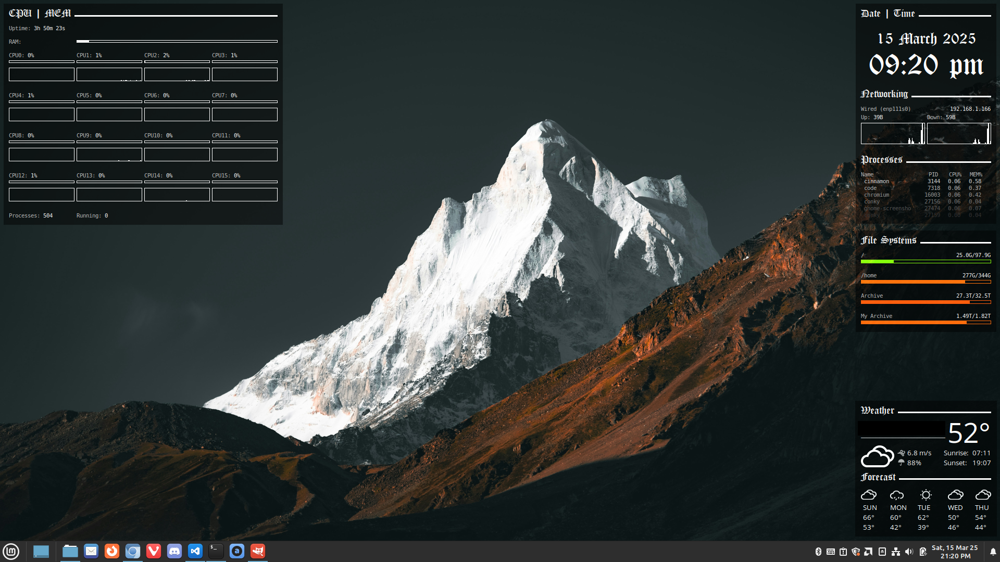

## How To Use:
Just run conky with the config set to one of the conkyrc_* files. Lua scripts should be in the same directory as the config files when run.

## Dependencies:
* Conky (with Lua support)
* Lua 5.x
* lfs (Lua filesystem module)

## Screenshot:

